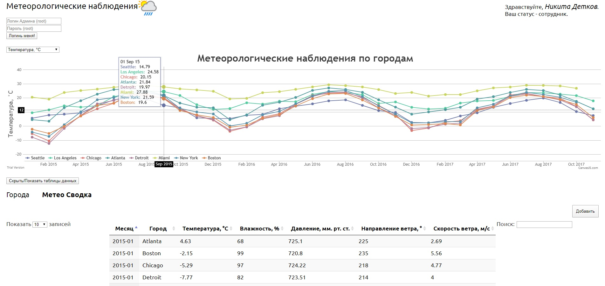

# Meteorological observations  

School project, nothing special: JS + jQuery + CanvasJS, HTML, CSS.  
Data was taken from [Historical Hourly Weather Data 2012-2017](https://www.kaggle.com/selfishgene/historical-hourly-weather-data).  

# Preview

